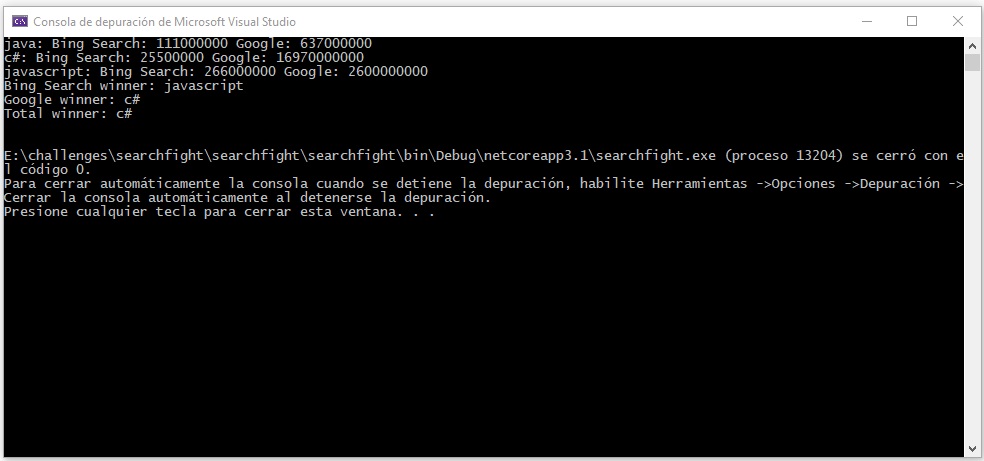

    

    <h1 align="center"> Search Fight Programming Languages Records  </h1>    

    <h2 align="center"> Console Application Built with NetCore 3.1</h2>    

 
This project uses web API to consume data from Bing and Google Search services, we send parameters related to the total amount of searches every programming language have in the world, then compare this information to provide a result of comparing every result.
